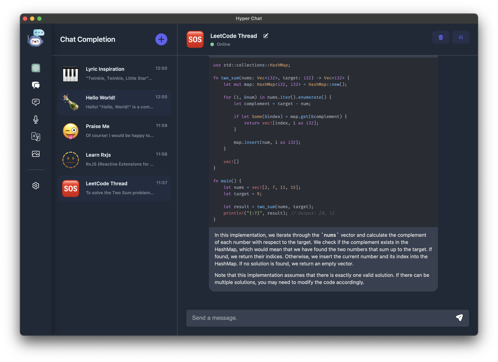
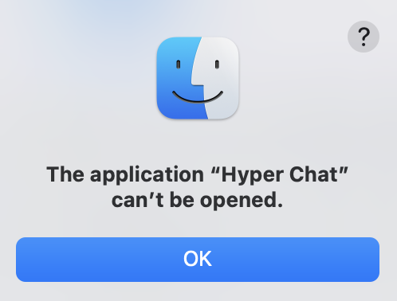

# Hyper Chat

## Introduction

Hyper Chat is a high-performance cross-platform AI chat application for desktop that is compatible with both OpenAI and Azure OpenAI services' APIs. In addition, Hyper Chat also provides features such as Text Completion, Image Generation, Audio Transcription, and Audio Translation.

## To start using Hyper Chat

You can download Hyper Chat on our [Landing Page](https://hyperchat.yancey.app), or manual download on [GitHub Release](https://github.com/HyperChatBot/hyperchat/releases/).

We always keep the dev tools(eg: Command + Option + I) open in the production environment. In Hyper Chat, everything is transparent and controllable.

### macOS

As Hyper Chat is not planning to be released on the App Store, you may encounter the following issue when you open it for the first time. Please follow the steps below to resolve it:

1. Move the Hyper Chat.app to the /Applications directory.
2. Open your terminal App, execute the command `chmod +x /Applications/Hyper\ Chat.app/Contents/MacOS/Hyper\ Chat`.

## To start developing Hyper Chat

### Prerequisites

We have chosen [Electron Forge](https://www.electronforge.io/) as our cross-platform base and use [React](https://react.dev/) + [Vite](https://vitejs.dev/) for rendering and packaging pages, so please install [Node.js](https://nodejs.org/en) globally in advance.

### Recommended IDE Setup

- [VS Code](https://code.visualstudio.com/)
- [Prettier](https://marketplace.visualstudio.com/items?itemName=esbenp.prettier-vscode)
- [Tailwind CSS IntelliSense](https://marketplace.visualstudio.com/items?itemName=bradlc.vscode-tailwindcss)
- [Eslint](https://marketplace.visualstudio.com/items?itemName=dbaeumer.vscode-eslint)

### Available Scripts

- To start development window, you can execute `npm run start`.
- To build the bundle, you can execute `npm run make`.

## Contributing

The main purpose of this repository is to continue to evolve Hyper Chat, making it faster and easier to use. Development of Hyper Chat happens in the open on GitHub, and we are grateful to the community for contributing bugfixes and improvements. Read below to learn how you can take part in improving Hyper Chat.

### [Code of Conduct](./CODE_OF_CONDUCT.md)

Hyper Chat has adopted a Code of Conduct that we expect project participants to adhere to. Please read [the full text](./CODE_OF_CONDUCT.md) so that you can understand what actions will and will not be tolerated.

### [Contributing Guide](./CONTRIBUTING.md)

Read our [contributing guide](./CONTRIBUTING.md) to learn about our development process, how to propose bugfixes and improvements, and how to build and test your changes to Hyper Chat.

### Good Issues

Please make sure to read the [Issue Reporting Checklist](./.github/ISSUE_TEMPLATE/bug_report.md) before opening an issue. Issues not conforming to the guidelines may be closed immediately.

## Upgrade Plans

We are continuously working to enhance Hyper Chat's capabilities and performance. Here are some of the features and upgrades that we plan to add in the future releases:

- Support function call and plugin
- Support audio input
- Support for Claude, Gemini, Llama and so on
- Improve Performance

## Discussions

If you have any questions or feedback about Hyper Chat, please visit our [official discussion forum](https://github.com/orgs/HyperChatBot/discussions/71) to start a conversation with our team or other users. We are committed to making Hyper Chat the best possible chat application, and your feedback plays a crucial role in achieving this goal.

## Thanks

The UI design is inspired by [Chat-Web-App-UI-Kit](https://www.figma.com/community/file/1167012734150108159/Chat-Web-App-UI-Kit), Thank you [Figma UI Free](https://www.figma.com/@figmauifree)!

## License

Hyper Chat is licensed under the terms of the [MIT licensed](https://opensource.org/licenses/MIT).
